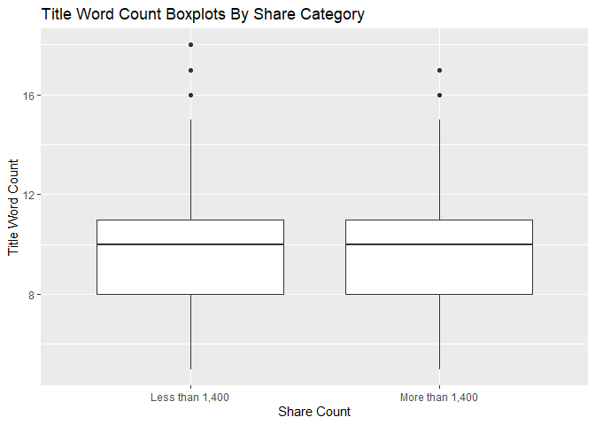

ST558 - Project 2
================
Group 9: Max Marion-Spencer & Xin Wang
2022-07-03

``` r
library(tidyverse)
library(tibble)
library(caret)
library(gbm)
library(knitr)
library(dplyr)
library(ggplot2)
library(corrplot)
library(vtable)
```

## Introduction

For this project, we will be using four models (two Linear Regression,
one Random Forest and one Boosted Tree) to make predictions on the
number of shares using the Online News Popularity dataset. This dataset
contains six different data channels, variables we choose for analysis
are:

-   Number of words in the title  
-   Number of words in the content  
-   Number of links  
-   Number of images  
-   Number of videos  
-   Number of keywords in the metadata  
-   Article published Day in a week  
-   Article published on the weekend or not

The response variable for the dataset is:

-   Number of Shares

We will randomly split the data into a training (70%) and a test (30%)
set and fit four models on the training set. We will then fit four
models on the test set and decide which model produces the best
prediction, which is the one with the smallest root mean squared error.

## Data

``` r
# read in data and select varaibles
news <- read_csv("OnlineNewsPopularity.csv", show_col_types = FALSE) %>% select(c(3,4,8,10,11,13,14:19,32:39,61))
colnames(news)
```

    ##  [1] "n_tokens_title"                "n_tokens_content"             
    ##  [3] "num_hrefs"                     "num_imgs"                     
    ##  [5] "num_videos"                    "num_keywords"                 
    ##  [7] "data_channel_is_lifestyle"     "data_channel_is_entertainment"
    ##  [9] "data_channel_is_bus"           "data_channel_is_socmed"       
    ## [11] "data_channel_is_tech"          "data_channel_is_world"        
    ## [13] "weekday_is_monday"             "weekday_is_tuesday"           
    ## [15] "weekday_is_wednesday"          "weekday_is_thursday"          
    ## [17] "weekday_is_friday"             "weekday_is_saturday"          
    ## [19] "weekday_is_sunday"             "is_weekend"                   
    ## [21] "shares"

``` r
news
```

``` r
# pivot data channel from wide to long 
news <- news %>%
  pivot_longer(
    cols = starts_with("data_channel"),
    names_to = "data_channel",
    values_to = "data_channel_type"
  ) %>%
  pivot_longer(
    cols = starts_with("weekday_is"),
    names_to = "weekday",
    values_to = "weekday_type"
  )

# remove prefix and filter both type with 1
news<- news %>% 
  mutate(weekday = str_sub(weekday, 12, -1),
          data_channel = str_sub(data_channel, 17, -1)) %>% 
  filter(data_channel_type == 1 & weekday_type ==1)
```

``` r
# factor weekday and data channel
news$weekday <- as.factor(news$weekday)
news$weekday<- ordered(news$weekday, levels=c("monday", "tuesday", "wednesday", "thursday", "friday", "saturday", "sunday"))
levels(news$weekday)
```

    ## [1] "monday"    "tuesday"   "wednesday" "thursday"  "friday"   
    ## [6] "saturday"  "sunday"

``` r
news$data_channel <- as.factor(news$data_channel)
levels(news$data_channel)
```

    ## [1] "bus"           "entertainment" "lifestyle"     "socmed"       
    ## [5] "tech"          "world"

``` r
# filter out one data channel 
news <- news %>% filter(data_channel == params$data_channel)
news
#summary(news)
```

``` r
# splitting data into training & test sets
set.seed(11)
train <- sample(1:nrow(news),size=nrow(news)*0.7)
test <- setdiff(1:nrow(news),train)
newsTrain <- news[train, ]
newsTest <- news[test, ]
```

## Summarizations

The table below shows count, mean, standard deviation, minimum, 25th
percentile, median, 75th percentile, and maximum of all of our numeric
variables: title word count, word count, number of links, number of
images, number of videos, and number of keywords. These summary
statistics can be useful for examining the center and spread of these
variables.

``` r
# Building summary statistics for our data
# NOTE: Using a standard output instead of kable, as the column names get
# grouped too closely together otherwise
news_summary <- sumtable(news[0:6], out = "return", add.median = TRUE)
news_summary
```

### Contingency Tables

This table shows the count of days in a week for article publish. It
helps us to see which day of the week article published the most and
whether there are more article published on the weekdays or weekends.

``` r
kable(t(table(newsTrain$weekday)), caption = "Article Published Day")
```

<table>
<caption>
Article Published Day
</caption>
<thead>
<tr>
<th style="text-align:right;">
monday
</th>
<th style="text-align:right;">
tuesday
</th>
<th style="text-align:right;">
wednesday
</th>
<th style="text-align:right;">
thursday
</th>
<th style="text-align:right;">
friday
</th>
<th style="text-align:right;">
saturday
</th>
<th style="text-align:right;">
sunday
</th>
</tr>
</thead>
<tbody>
<tr>
<td style="text-align:right;">
230
</td>
<td style="text-align:right;">
226
</td>
<td style="text-align:right;">
267
</td>
<td style="text-align:right;">
250
</td>
<td style="text-align:right;">
220
</td>
<td style="text-align:right;">
127
</td>
<td style="text-align:right;">
149
</td>
</tr>
</tbody>
</table>

We transform shares into a binary variable using the decision threshold
of 1,400. This contingency table shows the count of shares on the
weekdays and weekends.

``` r
newsTrain <- newsTrain %>% 
  mutate(SharesClass = if_else(shares >=1400, "More than 1,400","Less than 1,400"), 
         is_weekend = if_else(is_weekend== 0, "Weekday", "Weekend"))

kable(table(newsTrain$SharesClass,newsTrain$is_weekend), caption = "Count of Shares")
```

<table>
<caption>
Count of Shares
</caption>
<thead>
<tr>
<th style="text-align:left;">
</th>
<th style="text-align:right;">
Weekday
</th>
<th style="text-align:right;">
Weekend
</th>
</tr>
</thead>
<tbody>
<tr>
<td style="text-align:left;">
Less than 1,400
</td>
<td style="text-align:right;">
516
</td>
<td style="text-align:right;">
57
</td>
</tr>
<tr>
<td style="text-align:left;">
More than 1,400
</td>
<td style="text-align:right;">
677
</td>
<td style="text-align:right;">
219
</td>
</tr>
</tbody>
</table>

### Bar Plot

In this bar plot, we can see the count and the comparison of shares less
than 1,400 and shares more than 1,400 in a week, where longer bars
indicate higher values.

``` r
ggplot(newsTrain, aes(x = weekday)) + 
  geom_bar(aes(fill = SharesClass), position = "dodge") + 
  labs(x = "Week") + 
  scale_fill_discrete(name = "Shares") + 
  ggtitle("Shares by Week")
```

<!-- -->

### density plot

This density plot shows the distribution for number of shares on
weekdays and on weekends. Higher peak indicates there is a higher
concentration of points. If the curve is left skewed, then the mean is
less than the median. If the curve is right skewed, then the mean is
greater than the median. If the curve has no skew, then the mean is
equal to the median.

``` r
ggplot(newsTrain, aes(x = shares)) + 
  geom_density(alpha = 0.5, position = "stack", aes(fill = is_weekend)) +
  labs(title = "Density Plot for Shares") +
  scale_fill_discrete(name = "Week", labels = c("Weekday", "Weekend"))  
```

<!-- -->

### Correlation Plot

The correlation plot shows the correlation between all numeric predictor
variables. If the color is close to dark blue means there is a positive
correlation between two variables, if the color is close to dark red
means there is a negative correlation between two variables.

``` r
cor.variables <- newsTrain %>% 
  select(n_tokens_title, n_tokens_content, num_hrefs, num_imgs, num_videos,num_keywords)
correlation <- cor(cor.variables, method = "spearman")
corrplot(correlation)
```

<!-- -->

### Scatter Plot: n_tokens_content vs. num_imgs

Our first scatterplot shows us the relationship between image count and
word count, as well as shape and color aesthetics that show us high/low
shares and weekend/weekday respectively. The number of news articles
with low image count somewhat obscures the shape and color aesthetics
for a portion of the graph, but you use these key items to view
outliers, which can also provide additional interesting context to
sharing success and when the post was made.

``` r
# Creating a scatterplot of the number of words vs number of images
# NOTE: Adding some jitter to better convey where the majority of points lay
img_scatter <- ggplot(newsTrain, aes(x = n_tokens_content, y = num_imgs))
img_scatter + geom_point(aes(color = is_weekend, shape = SharesClass), position = "jitter") + geom_smooth(method = lm) +
  labs(title = "Image Count vs. Word Count", x = "Word Count", y = "Image Count", color = "Weekend or Weekday", shape = "Shares")
```

    ## `geom_smooth()` using formula 'y ~ x'

<!-- -->

### Scatter Plot: n_tokens_content vs. num_videos

This scatter plot shows us the trend in word count and video count, with
the addition of shape and color aesthetics that show us high/low shares
and weekend/weekday respectively. Because of the density of news
articles with relatively low video count, this is likely to primarily be
useful for determining the sharing success and weekday/end variables of
outliers. Either high video count or high word count outliers.

``` r
# Creating a scatterplot of the number of words vs number of videos
vid_scatter <- ggplot(newsTrain, aes(x = n_tokens_content, y = num_videos))
vid_scatter + geom_point(aes(color = is_weekend, shape = SharesClass), position = "jitter") + geom_smooth(method = lm) +
  labs(title = "Image Count vs. Video Count", x = "Word Count", y = "Video Count", color = "Weekend or Weekday", shape = "Shares") 
```

    ## `geom_smooth()` using formula 'y ~ x'

<!-- -->

### Boxplot of the Title Word Count vs. Share Category (Above 1,400 or Below 1,400)

This boxplot allows us to examine how the distribution of our two
sharing categories (\>1,400 and \<1,400) as they relate to the number of
words in the title of news articles. With this, we can see if there
might be a distinction between title length and what types of posts are
shared more frequently.

``` r
# Creating a boxplot of num title words vs share category
title_box <- ggplot(newsTrain, aes(x = SharesClass, y = n_tokens_title))
title_box + geom_boxplot() + 
  labs(title = "Title Word Count Boxplots By Share Category", 
       x = "Share Count", y = "Title Word Count")
```

<!-- -->

## Modeling

Our first two models are linear regression models.

Linear regression modelling allows you to examine the relationship
between a response variable and one or more predictor variables
typically by minimizing the distance between the distance between your
data points and a line (least squares regression.)

We will be examining two relatively basic linear models, one with only
our very basic predictor variables, and the other with all of our
numeric predictor variables.

### Linear Regression Model 1: Only basic numeric variables

This linear regression model contains just the most basic information
about the piece - the number of words in the title, the number of words
in the piece, and the number of both images and videos.

``` r
fit.lr1 <- train(shares ~ n_tokens_title + n_tokens_content + num_imgs + num_videos, 
                 data = newsTrain,
                 method = "lm",
                 preProcess = c("center", "scale"),
                 trControl = trainControl(method = "cv", number = 10))
fit.lr1 
```

    ## Linear Regression 
    ## 
    ## 1469 samples
    ##    4 predictor
    ## 
    ## Pre-processing: centered (4), scaled (4) 
    ## Resampling: Cross-Validated (10 fold) 
    ## Summary of sample sizes: 1322, 1322, 1322, 1322, 1322, 1321, ... 
    ## Resampling results:
    ## 
    ##   RMSE      Rsquared    MAE     
    ##   7586.023  0.01427179  3376.454
    ## 
    ## Tuning parameter 'intercept' was held constant at a value of TRUE

``` r
# on test set
pred1 <- round(postResample(predict(fit.lr1, newdata = newsTest), obs = newsTest$shares),3)
pred1
```

    ##     RMSE Rsquared      MAE 
    ## 7615.179    0.000 3220.399

### Linear Regression Model 2: All numeric variables

This linear regression model contains all of our numeric variables,
including links and keywords.

``` r
fit.lr2 <- train(shares ~ n_tokens_title + n_tokens_content + num_hrefs + num_imgs + num_videos + num_keywords, 
                 data = newsTrain,
                 method = "lm",
                 preProcess = c("center", "scale"),
                 trControl = trainControl(method = "cv", number = 10))
fit.lr2 
```

    ## Linear Regression 
    ## 
    ## 1469 samples
    ##    6 predictor
    ## 
    ## Pre-processing: centered (6), scaled (6) 
    ## Resampling: Cross-Validated (10 fold) 
    ## Summary of sample sizes: 1322, 1323, 1322, 1321, 1322, 1322, ... 
    ## Resampling results:
    ## 
    ##   RMSE      Rsquared    MAE     
    ##   8315.533  0.02304088  3345.927
    ## 
    ## Tuning parameter 'intercept' was held constant at a value of TRUE

``` r
# on test set
pred2 <- round(postResample(predict(fit.lr2, newdata = newsTest), obs = newsTest$shares),3)
pred2
```

    ##     RMSE Rsquared      MAE 
    ## 7626.017    0.000 3239.472

### Random Forest Model

Our random forest model is built on the concept of using multiple trees
from bootstrap samples, and then averaging the results in order to
reduce the susceptibility to variance that single trees have.

Our lone tuning parameter is:

\*mtry: The number of variables that are randomly sampled when we
determine splits for our tree.

``` r
fit.random <- train(shares ~ n_tokens_title + n_tokens_content + num_hrefs + num_imgs + num_videos + num_keywords,
                    method = "rf",
                    preProcess = c("center","scale"),
                    trControl = trainControl(method = "cv", number = 5),
                    tuneGrid = data.frame(mtry = 1:5),
                    data = newsTrain)
fit.random
```

    ## Random Forest 
    ## 
    ## 1469 samples
    ##    6 predictor
    ## 
    ## Pre-processing: centered (6), scaled (6) 
    ## Resampling: Cross-Validated (5 fold) 
    ## Summary of sample sizes: 1175, 1176, 1176, 1174, 1175 
    ## Resampling results across tuning parameters:
    ## 
    ##   mtry  RMSE      Rsquared     MAE     
    ##   1     8763.978  0.014150165  3346.195
    ##   2     9065.772  0.007782301  3510.906
    ##   3     9262.685  0.007428525  3583.498
    ##   4     9381.175  0.006033720  3644.965
    ##   5     9542.622  0.004461848  3687.231
    ## 
    ## RMSE was used to select the optimal model using the smallest value.
    ## The final value used for the model was mtry = 1.

``` r
# on test set
pred3 <- round(postResample(predict(fit.random, newdata = newsTest), obs = newsTest$shares),3)
pred3
```

    ##     RMSE Rsquared      MAE 
    ## 7703.636    0.001 3199.162

### Boosted Tree Model

The boosted tree model is a tree based method where the trees grow in a
sequential manner, each subsequent tree is based on the previous tree so
it updates the prediction as the tree grows. Boosted tree model slowly
trains the trees to ensure there is no overfitting for the training
data. There are four tuning parameters:

-   n.trees: Number of trees, increasing n reduces the error on training
    set  
-   interaction.depth: number of splits it has to perform on a tree
-   shrinkage: learning rate, reduce the impact of each additional
    fitted tree
-   n.minobsinnode: minimum number of observations in trees’ terminal
    nodes

``` r
fit.boost <- train(shares ~ n_tokens_title + n_tokens_content + num_hrefs + num_imgs + num_videos + num_keywords,
                 data = newsTrain,
                 method = "gbm",
                 preProcess = c("center", "scale"),
                 trControl = trainControl(method = "cv", number = 10),
                 tuneGrid = expand.grid(n.trees = c(50, 100, 150),
                                        interaction.depth = 1:3, 
                                        shrinkage = 0.1, 
                                        n.minobsinnode = 10),
                 verbose = FALSE)
fit.boost
```

    ## Stochastic Gradient Boosting 
    ## 
    ## 1469 samples
    ##    6 predictor
    ## 
    ## Pre-processing: centered (6), scaled (6) 
    ## Resampling: Cross-Validated (10 fold) 
    ## Summary of sample sizes: 1322, 1322, 1321, 1322, 1324, 1321, ... 
    ## Resampling results across tuning parameters:
    ## 
    ##   interaction.depth  n.trees  RMSE      Rsquared    MAE     
    ##   1                   50      8096.253  0.01385171  3373.756
    ##   1                  100      8157.114  0.01465770  3402.909
    ##   1                  150      8126.057  0.02276499  3369.029
    ##   2                   50      8110.126  0.01780362  3377.691
    ##   2                  100      8162.232  0.01898941  3427.320
    ##   2                  150      8181.615  0.01601388  3421.492
    ##   3                   50      8181.557  0.01713734  3400.528
    ##   3                  100      8286.618  0.01788032  3470.490
    ##   3                  150      8424.179  0.01851455  3515.004
    ## 
    ## Tuning parameter 'shrinkage' was held constant at a value of 0.1
    ## 
    ## Tuning parameter 'n.minobsinnode' was held constant at a value of 10
    ## RMSE was used to select the optimal model using the smallest value.
    ## The final values used for the model were n.trees = 50,
    ##  interaction.depth = 1, shrinkage = 0.1 and n.minobsinnode = 10.

``` r
# on test set
pred4 <- round(postResample(predict(fit.boost, newdata = newsTest), obs = newsTest$shares),3)
pred4
```

    ##     RMSE Rsquared      MAE 
    ## 7665.512    0.000 3169.600

## Comparison

The table below shows our four models and their respective RMSE,
Rsquared and MAEs.

For the purposes of model selection, we will be choosing the model with
the lowest RMSE as our final model.

``` r
compare <- data.frame(pred1, pred2 , pred3, pred4)
colnames(compare) <- c("basic linear regression","linear regression","random forest","boosted tree")
compare
```

``` r
# Building a quick compare function
compare_func <- function(compare){
  temp <- names(which.min(compare[1,]))
  return(cat("We have selected our",temp,"model- as this is the model with the lowest RMSE."))
}
```

*For our final model selection:*

``` r
compare_func(compare)
```

    ## We have selected our basic linear regression model- as this is the model with the lowest RMSE.

## Automation

``` r
data_channel <- c("bus","entertainment","lifestyle","socmed","tech","world")
output_file <- paste0(data_channel, "Analysis.md")
params = lapply(data_channel, 
                FUN = function(x){
                  list(data_channel = x)})
reports <- tibble(output_file, params)
apply(reports, 
      MARGIN = 1,
      FUN = function(x){
        rmarkdown::render(input = "st558 - project2.Rmd", 
                          output_format = "github_document", 
                          output_options = list(html_preview = FALSE), 
                          output_file = x[[1]], 
                          params = x[[2]])})
```
